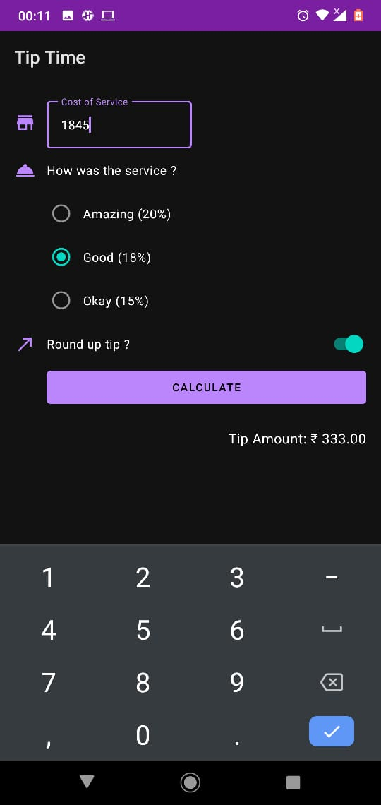

# tip_calculator

## --> This app is made in kotlin language
## --> In this you calculate tip based on the cost of service and how was the service
## --> You can choose service quality via radioButtons (amazing, good & okay)
## --> There is also an option to round up the total tip 
## --> This app also have dark theme enabled (for this dark theme should be enabled in setting/display/dark theme)
## Screenshot
                   
